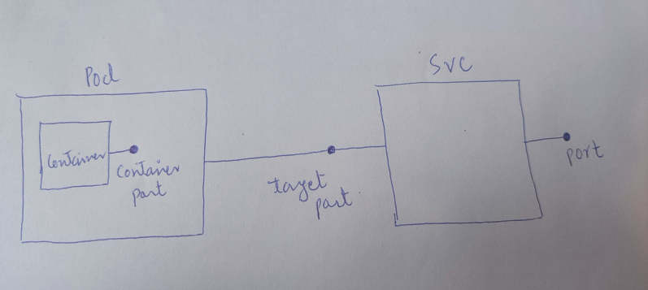

# Kubernetes

##  To create a deployment

Deployment  manages replicasets , replicasets manages pods and pod is the astraction of container.
```
kubectl create deployment nginx --image=nginx --replicas=5
```
To edit;
```
kubectl edit deployment nginx
```

## To look into logs
```
kubectl logs <pod_name>
```

## To login to container
```
kubectl exec -it <pod_name> -- bin/bash
```
To store the configuration in to a file
```
kubectl get service my-service -o yaml > service.yaml
kubectl get pod -o wide 
```

## To create a pod
```
apiVersion: v1
kind: Pod
metadata: 
  name: test-nginx
  labels:
    app: nginx
spec:
  containers:
  - name: nginx
    image: nginx:1.14.2
    ports: 
    - containerPort: 80 # always the port where application is serving

```

## Port forward
```
kubectl port-forward <pod_name> <localhost_port_where_you_want_to_forward>:<container_port_of_pod>
```

## To create a external service with a pod
```
apiVersion: v1
kind: Pod
metadata: 
  name: test-nginx
  labels: # label of the pod
    app: nginx
spec:
  containers:
  - name: nginx
    image: nginx:1.14.2
    ports: 
    - containerPort: 80 # always the port where application is serving

---
apiVersion: v1
kind: Service
metadata:
  name: nginx-svc
spec:
  selector: # pod label
    app: nginx
  type: LoadBalancer
  ports:
  - port: 80
    targetPort: 80
    nodePort: 30007
```
### Diff between port, containerPort and targetPort
target Port and containerPort are same, must have same value but used in different (pod and svc respectively) resources of kubernetes.
port - port of the service where service will listen for incoming traffic.
targetPort - targetPort is required by Service to specify the port on which pods (of service) should listen to incoming traffic. If `targetPort` is not specified, it is default to `port`
containerPort -  Where container inside pod is listening for  incoming ports.


To get the url of external service
```
minikube service <service_name> --url
```

## Deployments

### To create a deployment
```
apiVersion: apps/v1
kind: Deployment
metadata: 
  name: deployment-nginx
spec:
  replicas: 2 # create a replicaSet of two pods
  selector: #  through this field replicas find the pods by matching labels of app: nginx
    matchLabels:
      app: nginx
  template:
    metadata:
      labels:
        app: nginx
    spec:
      containers:
      - name: nginx
        image: nginx:1.14.1
        ports: 
        - containerPort: 80 # always the port where application is serving

---
apiVersion: v1
kind: Service
metadata:
  name: nginx-svc
spec:
  selector: # pod label
    app: nginx
  type: LoadBalancer
  ports:
  - port: 80
    nodePort: 30008
```

### to see deployment rollout status
```
kubectl rollout status deployment/<deployment_name>
```

### Edit the deployment
```
kubectl edit deployments <deployment_name>
# some vim commands to edit
- i -> to enter edit mode
- esc -> to exit edit mode
- ctrl + c -> to exit
- :wq -> to exit by saving.
```

### To roll back a deployment to previous revision
```
kubectl rollout undo deployment/deployment-nginx
kubectl rollout undo deployment/deployment-nginx --to-revision=2
```

## Scaling
Scaling up deployment;
```
kubectl scale deployment <deployment_name> --replicas=10
```

Scaling down deployment;
```
kubectl scale deployment <deployment_name> --replicas=5
```

**HPA (HorizontalPodAutoscaler)**
-  Automatically scales the  pods to match workload demand if it gets pod cpu-usage exceeds `--cpu-percent` value. 
```
kubectl autoscale deployment/deployment-nginx --min=2 --max=10 --cpu-percent=50
```

## Ingress
It is used for DNS. We need an ingress controller. For that we use ingresss controller.
Ingress exposes HTTP and HTTPS routes from outside to services within cluster. Traffic routing is controlled by rules defined on the ingress resource. 
```
client -> ingress_controller -> ingress -> routing_rule -> service -> pod
```

### Install ingress-controller in minikube
Run the following command, and it will enable nginx-ingress controller (this nginx-ingress controller can also be used in production).

```
minikube addons enable ingress
```

Write the ingress yaml;
```
apiVersion: networking.k8s.io/v1
kind: Ingress
metadata:
  name: nginx-ingress
spec:
  rules:
  - host: nginx.ingress.com # hostname
    http: # http forwarding to internal service
      paths:
      - backend: 
          service: 
            name: nginx-svc # internal service which you want to access.
            port: 
              number: 8080 # service port.
        pathType: Prefix
        path: /
```

Configure the hostname in /etc/host config file. We can get the ip address of ingress by `kubectl get ingress --watch`
```
192.168.49.2 (ip_address of ingress)    nginx.ingress.com (hostname defined in ingress)
```

To configure a path for hostname, we have to use annotations;

```
apiVersion: networking.k8s.io/v1
kind: Ingress
metadata:
  name: nginx-ingress
  annotations:
    nginx.ingress.kubernetes.io/rewrite-target: /
spec:
  rules:
  - host: nginx.ingress.com # hostname
    http: # http forwarding to internal service
      paths:
      - backend: 
          service: 
            name: nginx-svc # internal service which you want to access.
            port: 
              number: 8080 # service port.
        pathType: Prefix
        path: /test
```

## To create a config map

## To create a secret
Secrets live in k8s not in application repository


## To create stateful set